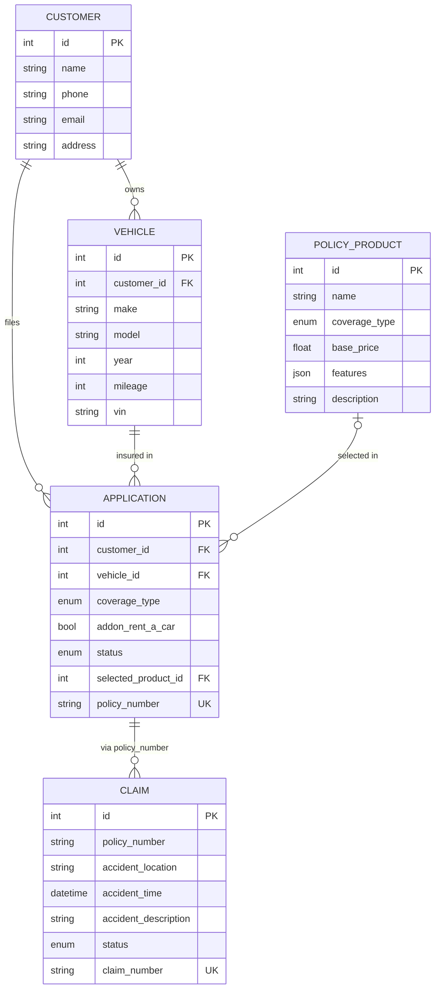

# Vehicle Insurance Chatbot

A conversational AI assistant that lets users apply for vehicle insurance, file
claims, and check claim status - backed by a simple insurance REST API.

## Structure

| Path                    | What it is                                                          |
| ----------------------- | ------------------------------------------------------------------ |
| `insurance-api/`        | The insurance system: a pure REST backend (no LLM). Owns the data. |
| `chatbot-api/`          | The chatbot: a LangGraph agent that calls the insurance API.       |
| `chatbot-api/frontend/` | A single-page chat UI, served by the chatbot at `/`.               |
| `docs/`                 | Design document.                                                    |

The chatbot is a *client* of the insurance API; the two services never share a
database. See `docs/design.md` for the full design and the reasoning behind each
decision.

## Stack

Python 3.10+, FastAPI, Pydantic v2, SQLAlchemy 2.0 (async), LangGraph (agent),
Google Gemini (`gemini-2.5-flash-lite`). SQLite and an in-memory agent
checkpointer are used for local development; Postgres and a persistent
checkpointer are the production targets (see "Dev vs production" below).

## Prerequisites

- Python 3.10+
- A free Google Gemini API key from https://aistudio.google.com (no card needed)

## Setup

Each service has its own virtual environment.

Insurance API:

```
cd insurance-api
python -m venv .venv
.\.venv\Scripts\python.exe -m pip install -r requirements-dev.txt
.\.venv\Scripts\python.exe -m app.seed
```

Chatbot API:

```
cd chatbot-api
python -m venv .venv
.\.venv\Scripts\python.exe -m pip install -r requirements-dev.txt
copy .env.example .env
```

Then edit `chatbot-api\.env`:

```
GOOGLE_API_KEY=your-key-here
GEMINI_MODEL=gemini-2.5-flash-lite
INSURANCE_API_URL=http://127.0.0.1:8001
```

## Run

Two terminals, insurance API first:

```
# terminal 1
cd insurance-api
.\.venv\Scripts\python.exe -m uvicorn app.main:app --port 8001

# terminal 2
cd chatbot-api
.\.venv\Scripts\python.exe -m uvicorn app.main:app --port 8000
```

Then open http://127.0.0.1:8000 and start chatting.

- Insurance API docs (Swagger UI): http://127.0.0.1:8001/docs
- Health checks: `GET /health` on both services.


## Run with Docker (production-like)

Requires Docker Desktop running. From the project root:

```
# Create a root .env with your Gemini key (gitignored)
copy .env.example .env
# Edit .env: set GOOGLE_API_KEY=your-key-here

# Build and start everything (Postgres + insurance API + chatbot)
docker compose up --build

# Or in detached mode:
docker compose up --build -d
docker compose logs -f
```

This brings up three containers:
- **postgres** (port 5432) - the insurance database
- **insurance-api** (port 8001) - seeded and ready
- **chatbot-api** (port 8000) - chat UI at http://localhost:8000

To stop: `docker compose down`. Data persists in a Docker volume; to reset:
`docker compose down -v`.
## What the chatbot can do

- **Apply for insurance** - collects customer and vehicle details and a coverage
  choice (Full or Third Party, with an optional rent-a-car add-on), drafts the
  application, lists the applicable plans, and after you confirm returns a policy
  number.
- **File a claim** - collects the policy number and accident details, verifies
  the policy is valid, and after you confirm returns a claim number.
- **Check a claim** - returns the current status for a claim number.

The assistant always summarises and waits for an explicit "yes" before it
submits anything irreversible.

## Tests

```
cd insurance-api
.\.venv\Scripts\python.exe -m pytest
```

## Dev vs production

| Concern            | Local dev              | Docker (done)                    | Remaining          |
| ------------------ | ---------------------- | -------------------------------- | ------------------- |
| Insurance database | SQLite                 | Postgres 16 via compose          | -                   |
| Schema bootstrap   | `create_all`           | `create_all`                     | Alembic migrations  |
| Chat memory        | in-memory checkpointer | in-memory checkpointer           | persistent (PG/Redis)|
| HTTP client        | pooled                 | pooled                           | -                   |
| CORS               | `*` (dev)              | configurable `CORS_ALLOW_ORIGINS`| + auth              |
| Packaging          | local venvs            | Dockerfiles + compose            | -                   |
| Agent date         | per-request            | per-request                      | -                   |

## Notes on the Gemini free tier

The free tier is rate-limited per minute and per day, per model. The agent makes
several model calls per conversation turn, so a heavy turn can trip the
per-minute limit and return a friendly `503`; wait a few seconds and retry.
Free-tier prompts may be used by Google to improve their models, so do not send
real personal data.

## Data model



Legend: `||` exactly one, `o{` zero-or-many, `|o` zero-or-one; `PK` primary key,
`FK` foreign key, `UK` unique. Every table except `policy_products` also carries
a `created_at` timestamp. The application-to-claim link is by policy number
(validated in the service layer), not a hard foreign key.