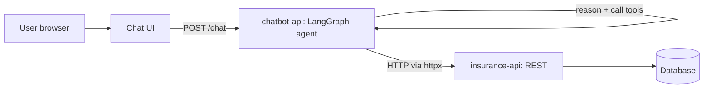

# Design: Vehicle Insurance Chatbot

This document describes the design of the system, how it is implemented, and the
reasoning behind the main decisions.

## 1. Goal

A conversational assistant that lets a user do three things in plain language:

1. Apply for vehicle insurance.
2. File an insurance claim.
3. Check the status of a claim.

Each flow follows the same shape: collect the needed information, show a draft,
get explicit confirmation, then return an identifier (policy or claim number).

## 2. Architecture

The system is split into two independent services:

- **insurance-api** - a pure REST backend. It owns all the data (customers,
  vehicles, policy products, applications, claims) and contains no LLM code. It
  is the system of record.
- **chatbot-api** - a LangGraph agent (Google Gemini) that talks to users and
  calls the insurance API over HTTP to get things done. It also serves the
  single-page chat UI.

### Why two services

The insurance system and the assistant have different jobs and change at
different rates. Keeping them separate means the insurance API is independently
testable and usable without the LLM; the chatbot can be rebuilt or scaled
without touching the system of record; and there is a clear trust boundary - all
data rules (validation, status transitions, numbering) live in one place and
cannot be bypassed by the agent. The two never share a database; the chatbot
reaches data only through the REST API, like any other client.

## 3. The insurance API

Layered so each concern is isolated and testable:

- **models/** - SQLAlchemy ORM models (the five tables).
- **schemas/** - Pydantic v2 request/response models, separate from the ORM.
- **services/** - business logic (drafting, selecting, confirming, verifying,
  numbering, status). Routers stay thin.
- **routers/** - FastAPI endpoints that call services and return schemas.

### Endpoints

Apply flow:

- `POST  /applications` - create a draft from customer + vehicle + coverage.
- `GET   /applications/{id}/policies` - list the plans applicable to that draft.
- `PATCH /applications/{id}` - select a plan.
- `POST  /applications/{id}/confirm` - submit; returns the policy number.
- `GET   /applications/{id}` - read a full application.

Claim flow:

- `POST /claims` - create a draft from policy number + accident details.
- `POST /claims/{id}/verify` - check the policy number is valid.
- `POST /claims/{id}/confirm` - submit; returns the claim number.
- `GET  /claims/{claim_number}` - check status.

Plus `GET /health`.

### Data model

See the ER diagram in the root README. Five tables: customers, vehicles,
policy_products (the catalogue), applications, claims. Notable points:

- Enums (coverage type, application status, claim status) are stored as lowercase
  string values, portable across SQLite and Postgres.
- Policy and claim numbers are generated from the row id on confirmation:
  `POL-{year}-{id:05d}` and `CLM-{year}-{id:05d}`. Using the id keeps them unique
  without a separate counter.
- A claim references a policy by its policy-number string, validated in the
  service layer - a deliberate loose coupling rather than a hard foreign key.

### Validation

Pydantic v2 enforces input rules at the edge: email format, VIN length, year and
mileage ranges, phone pattern, non-empty fields. Invalid input returns 422
before any business logic runs.

## 4. The chatbot

### Agent

A LangGraph ReAct agent built with `create_react_agent`:

- The model is Google Gemini with the eight tools bound to it.
- Each turn the agent loops: the model reasons and may emit tool calls, a tool
  node executes them, results return to the model, and the loop continues until
  the model produces a final reply with no tool calls.
- A checkpointer persists message history per `thread_id`. The `/chat` endpoint
  uses the conversation's `session_id` as the `thread_id`, so each user has their
  own remembered conversation. In dev this is an in-memory checkpointer; in
  production it becomes a persistent one.

### Tools

Eight tools wrap the insurance API client (one async httpx method per endpoint):
create_application, list_policies, select_policy, confirm_application,
create_claim, verify_claim, confirm_claim, check_claim_status. Each returns a
compact JSON string of the key fields and converts HTTP errors into a small
`{"error": ...}` message the agent relays kindly rather than crashing.

### System prompt

The prompt gives the assistant a warm, non-robotic persona, teaches it the two
flows step by step, tells it to ask for missing fields naturally (a few at a
time, not as a form), and to present tool results in plain language rather than
raw JSON. The current date and time are injected so it can resolve relative
dates like "yesterday at 3pm".

### Confirm-gating

The one hard rule: never call confirm_application or confirm_claim until the user
has explicitly confirmed. This is enforced two ways - the system prompt states it
plainly, and confirm is a separate tool from create/select, so submitting is
always a distinct, deliberate step. (LangGraph also supports a stricter
graph-level interrupt before the confirm step; the prompt-based gate was chosen
for simplicity and is sufficient here.)

### Frontend

A single self-contained index.html (HTML/CSS/vanilla JS, no build step) served by
the chatbot at `/`. It holds the session_id across turns, renders the
conversation, and renders interactive UI widgets for plans and receipts. It also integrates the native Web Speech API for low-latency Speech-to-Text (microphone input) and Text-to-Speech (bot voice replies).

## 5. Key decisions

**Two services, loose coupling.** The chatbot is a REST client of the insurance
API; they never share a database, and a claim links to a policy by
policy-number string validated in the service layer, not a hard FK. This keeps
the claim flow independent and mirrors how the two would be separate systems in
practice.

**SQLAlchemy for database-agnosticism.** The same code runs on SQLite locally
(zero setup) and Postgres in production by changing only the connection string.
`create_all` bootstraps the schema in dev; Alembic migrations are the production
answer.

**Pydantic schemas separate from ORM models.** The API contract is decoupled from
the storage shape, so each can change independently and validation lives at the
edge.

**Service layer.** Business rules live in services, not routers or models, so
they are reusable, unit-testable, and the routers stay thin.

**LangGraph over a hand-rolled loop.** The agent loop, tool execution, and
per-conversation memory come from a maintained library with clear, inspectable
control flow, and it leaves room to add graph-level gates (e.g. human approval)
later.

**Tools return data, the model presents it.** Tools emit compact JSON; the prompt
makes the model turn that into friendly prose. This keeps a clean seam between
what happened and how it is phrased, and the JSON is also what the widget bonus
will render from.

**Gemini free tier, flash-lite.** No credit card required.
`gemini-2.5-flash-lite` has the most generous free per-minute and per-day limits
among the free models and supports function calling. Because the agent makes
several calls per turn, the endpoint handles rate-limit/availability errors
gracefully with a 503 and a clear message instead of a 500.

**No MongoDB.** Nothing in the domain is document-shaped; a relational model fits
customers, vehicles, applications, and claims cleanly, so a second datastore
would add complexity for no benefit.

## 6. Testing and quality

- The insurance API has a pytest suite covering both happy paths and the
  404 / 409 / 422 error paths, run against an in-memory SQLite database with the
  session dependency overridden, so tests are fast and isolated.
- Both services are kept clean under pyright (basic mode, pinned to each
  service's venv).
- The chatbot's HTTP client, tools, and full agent flows were verified end to end
  against the live backend during development.

## 7. Known limitations and future work

Completed in the production pass:

- SQLite -> Postgres 16 (via `docker compose`, the insurance API is
  DB-agnostic through SQLAlchemy; swapped by changing `DATABASE_URL`).
- Dockerfiles for both services and a `docker-compose.yml` that brings up
  Postgres, the insurance API, and the chatbot in one command.
- httpx client-per-request -> pooled persistent client with clean shutdown.
- Build-time date injection -> per-request via callable prompt.
- CORS middleware with a configurable `CORS_ALLOW_ORIGINS` setting.
- API Security via a mock `X-API-Key` dependency injection on the insurance API.
- **Widgets** - render policy comparisons, receipts, and status badges as UI cards.
- **Voice** - low-latency speech in and out using the browser's Web Speech API.
- **RAG** - grounds answers about coverage wording in a synthetic knowledge base using Gemini embeddings and an in-memory vector store.

Remaining work:

- `create_all` -> Alembic migrations for safe schema changes.
- In-memory agent checkpointer -> persistent (langgraph-checkpoint-postgres or Redis).
- Full JWT/OAuth2 Auth for the insurance API (currently using a mock API key).

The Gemini free tier's per-minute limit can interrupt a heavy turn; a model
fallback or a paid tier would remove that for production.